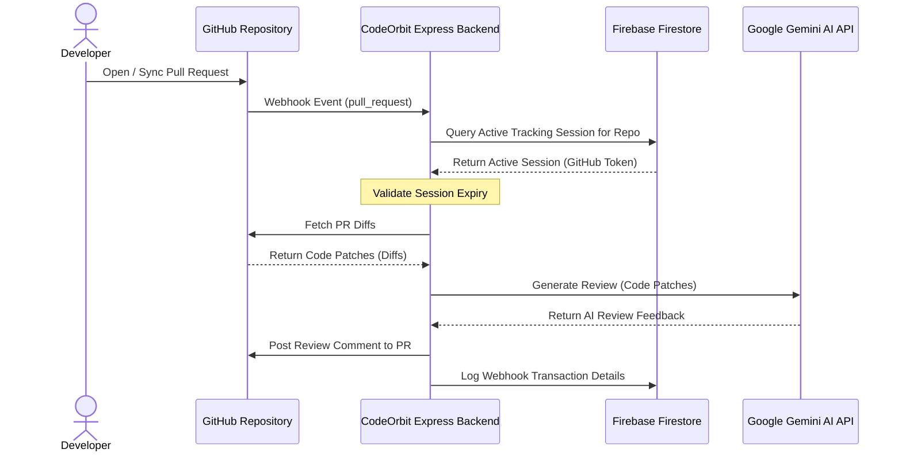

<p align="center">
  
</p>

<h1 align="center">CodeOrbit</h1>

<p align="center">
  <strong>Everything around your code ecosystem.</strong><br />
  An AI-powered GitHub Pull Request reviewer that automatically posts code quality feedback, optimization suggestions, and bug detection comments directly onto your PRs.
</p>

<p align="center">
  
  
  
  
  
</p>

---

## 🌟 Project Overview

**CodeOrbit** is a modern, full-stack, AI-powered automation tool designed to streamline code review workflows. By integrating directly with GitHub Webhooks and utilizing Google's advanced **Gemini 2.5 Flash** model, CodeOrbit analyzes codebase diffs on incoming Pull Requests and immediately generates inline feedback. 

With CodeOrbit, developers can authenticate, link their GitHub accounts, choose which repositories to track, and set active tracking durations. Webhook registration is handled automatically behind the scenes, offering a frictionless setup experience.

---

## ✨ Key Features

*   🤖 **AI-Driven Code Reviews**: Leverages Google Gemini 2.5 Flash to inspect PR code patches, identify bugs, suggest optimizations, and ensure coding best practices.
*   ⚡ **Automated Webhook Management**: Programmatically configures webhook subscriptions (`pull_request` events) for GitHub repositories using personal OAuth/Access tokens.
*   🕒 **On-Demand Tracking Duration**: Choose how long to track a repository (from 1 to 30 days). Expired sessions automatically stop webhook actions.
*   🛡️ **Secure Session Storage**: Uses Firebase Firestore to keep track of active sessions, securely store tokens, and record webhook execution logs.
*   🔐 **Firebase Authentication**: Seamless signup and login flow supporting Email/Password and OAuth Social sign-ins (Google, GitHub).
*   🎨 **Premium Aesthetic UI**: Built with a gorgeous glassmorphic theme, responsive dashboard grid layout, CSS micro-animations, and dynamic light/dark mode settings.

---

## 📐 System Architecture



---

## 🛠️ Technology Stack

### Frontend
*   **Vite + React 19**
*   **Firebase SDK** (Authentication & Firestore connection)
*   **Lucide React** (Vector Icons)
*   **React Router DOM** (Navigation)
*   **Custom Vanilla CSS** (Responsive Glassmorphism design system)

### Backend
*   **Node.js & Express**
*   **Firebase Admin SDK**
*   **Google Generative AI SDK** (`@google/generative-ai`)
*   **GitHub REST API** (Diff extraction and comment posting)

---

## 🚀 Getting Started

Follow these steps to run CodeOrbit locally on your machine.

### Prerequisites
*   [Node.js](https://nodejs.org/) installed (v18+ recommended)
*   A [Firebase Project](https://console.firebase.google.com/) with Authentication (Email, Google, and GitHub providers) and Cloud Firestore enabled.
*   A Google AI Studio [Gemini API Key](https://aistudio.google.com/).
*   A GitHub Personal Access Token (with `repo` permissions to read files and post comments).

---

### 📂 Repository Structure
```
CodeOrbit/
├── backend/            # Express.js Server
│   ├── aiService.js     # Gemini AI API wrapper
│   ├── githubService.js # GitHub API calls for diffs/comments
│   ├── firebaseAdmin.js # Firebase Admin initialization
│   ├── index.js         # API Routes & Webhook controller
│   └── package.json
└── frontend/           # Vite React App
    ├── src/
    │   ├── assets/      # Image assets (Logo, Robots)
    │   ├── Dashboard.jsx# Active tracking & repo configuration UI
    │   ├── Login.jsx    # Authentication Login page
    │   ├── SignUp.jsx   # Authentication Signup page
    │   ├── main.jsx     # App mounting entrypoint
    │   └── index.css    # Theme variables and layout styles
    └── package.json
```

---

### 🔧 Setup & Installation

#### 1. Clone the repository
```bash
git clone https://github.com/your-username/CodeOrbit.git
cd CodeOrbit
```

#### 2. Backend Configuration
Create a `.env` file in the `/backend` directory:
```env
PORT=3000
FIREBASE_PROJECT_ID=your-firebase-project-id
FIREBASE_CLIENT_EMAIL=your-firebase-admin-sdk-email
FIREBASE_PRIVATE_KEY="your-firebase-private-key"
GEMINI_API_KEY=your-gemini-api-key
```

*Install backend dependencies:*
```bash
cd backend
npm install
```

#### 3. Frontend Configuration
Create a `.env` file in the `/frontend` directory:
```env
VITE_FIREBASE_API_KEY=your-firebase-api-key
VITE_FIREBASE_AUTH_DOMAIN=your-firebase-auth-domain
VITE_FIREBASE_PROJECT_ID=your-firebase-project-id
VITE_FIREBASE_STORAGE_BUCKET=your-firebase-storage-bucket
VITE_FIREBASE_MESSAGING_SENDER_ID=your-firebase-messaging-sender-id
VITE_FIREBASE_APP_ID=your-firebase-app-id
VITE_BACKEND_URL=http://localhost:3000
```

*Install frontend dependencies:*
```bash
cd ../frontend
npm install
```

---

### 🏃 Running Locally

To run CodeOrbit, you'll need to spin up both the backend server and the frontend client.

#### Start the Express Backend:
```bash
cd backend
npm start
```
*The server will run on `http://localhost:3000` (or the port defined in your environment).*

#### Start the React Frontend:
```bash
cd frontend
npm run dev
```
*Vite will compile and launch the frontend, typically at `http://localhost:5173`.*

---

## 💡 How it Works Under the Hood

1.  **Authorization**: Users sign in via Firebase OAuth. When signing in using GitHub, CodeOrbit captures the GitHub API Access Token and saves it to a `tracking_sessions` document in Firestore.
2.  **Tracking Setup**: The user selects a repository from their GitHub list, inputs the tracking duration, and starts tracking.
3.  **Webhook Auto-Setup**: The frontend triggers the backend API endpoint `/api/webhooks/setup`. The backend calls the GitHub API to register a webhook pointing to the backend's public payload URL (e.g., Render host).
4.  **Diff Generation**: When a developer opens a Pull Request on a tracked repository, GitHub triggers a webhook event.
5.  **Review Processing**: The CodeOrbit backend receives the event, verifies that there is an active tracking session in Firestore, fetches the code diffs for modified files from GitHub, feeds them to Gemini, and posts the resulting code critique directly back to the GitHub PR.

---

## 📄 License
This project is licensed under the ISC License. See the [package.json](backend/package.json) file for details.
